# Loot art review — 2026-09-16

94 generated-mesh replacements; 2 items retain their original art. Each sheet contains eight actual Roblox front views and their black silhouettes.

## zone01 museum

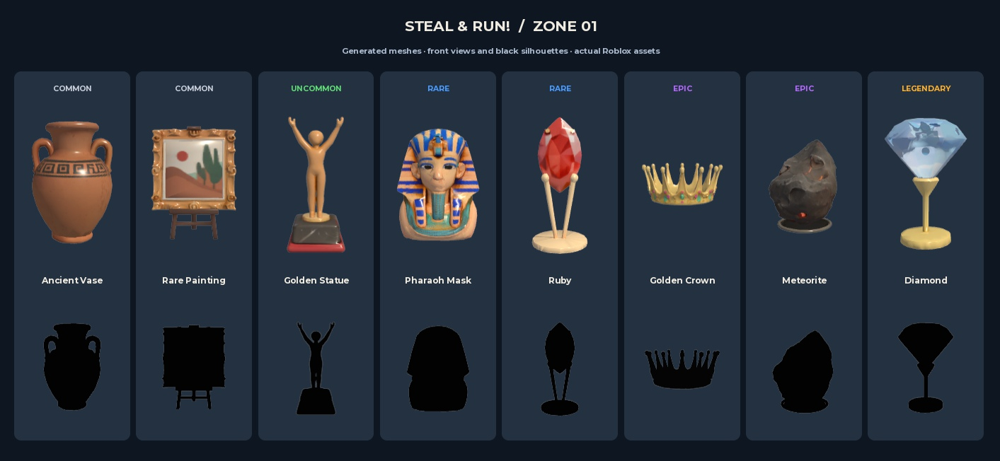

## zone02 pirate

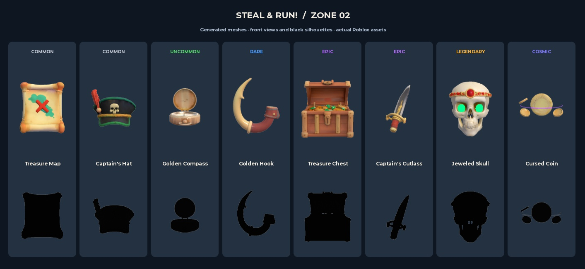

## zone03 castle

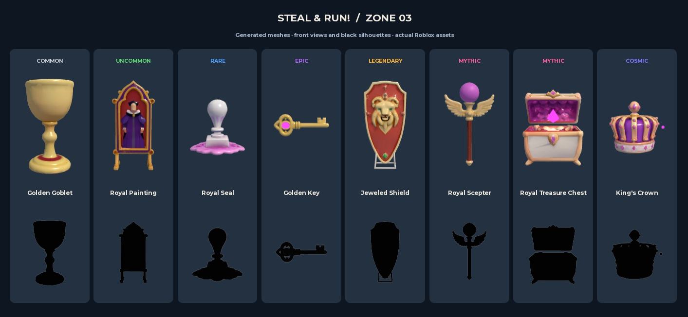

## zone04 area51

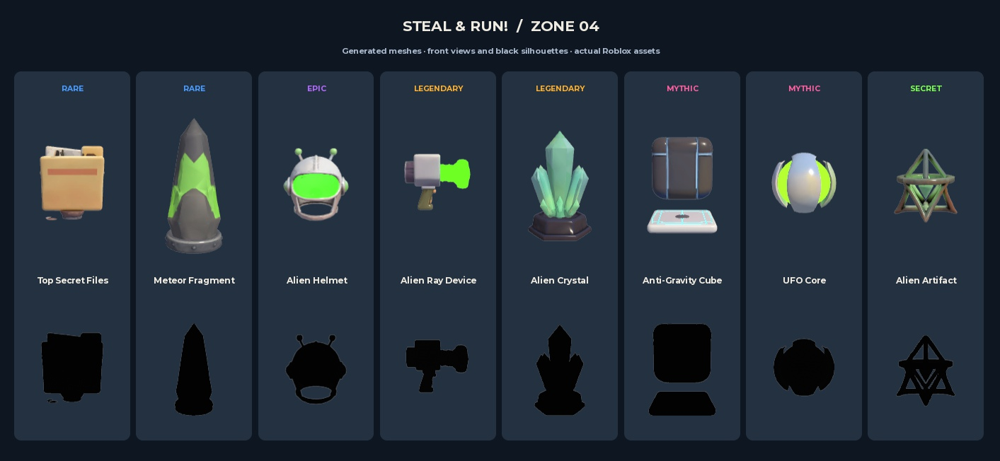

## zone05 northpole

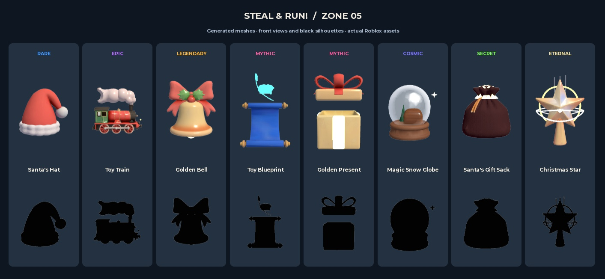

## zone06 egypt

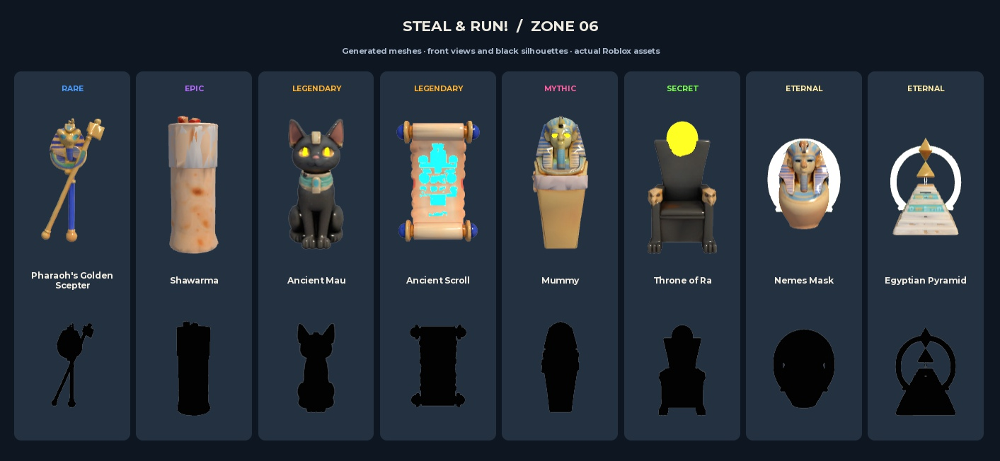

## zone07 gym

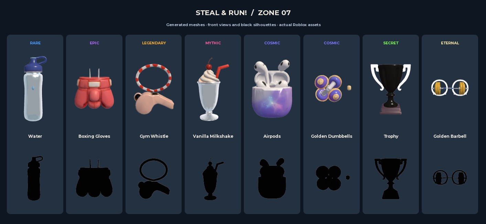

## zone08 bank

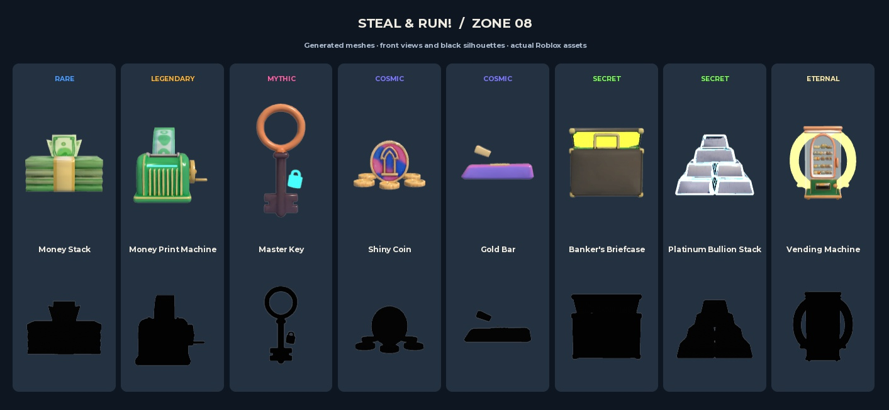

## zone09 secretlab

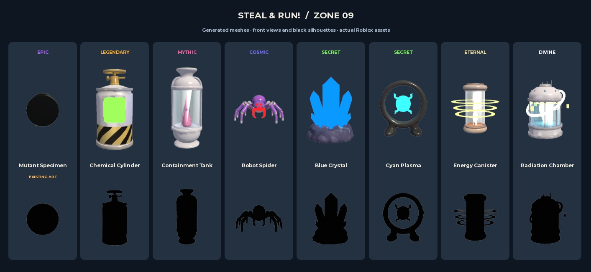

## zone10 grandma

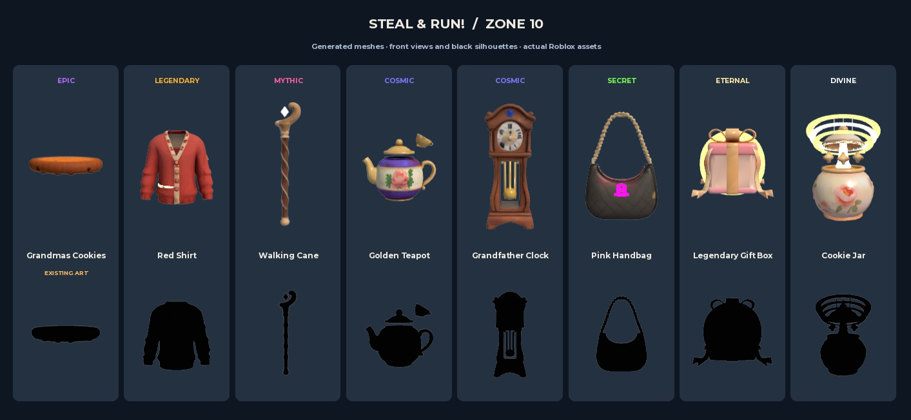

## zone11 construction

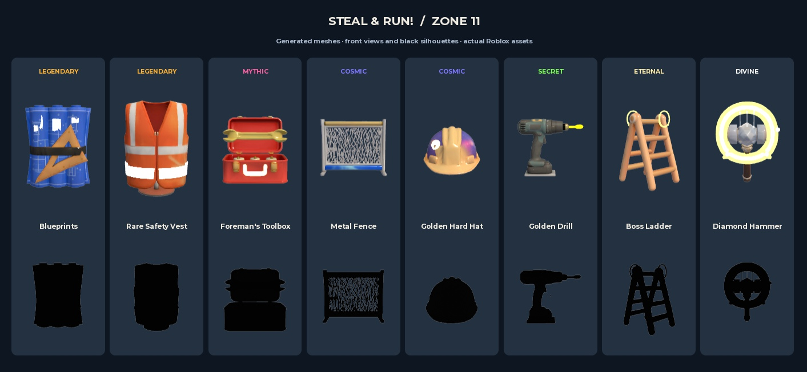

## zone12 airport

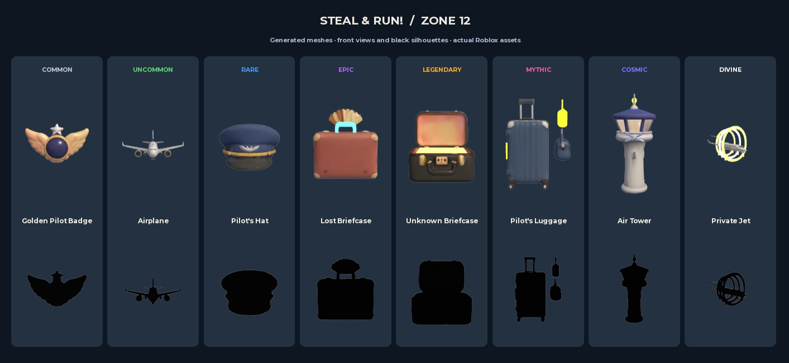

## Runtime checks

[approved vase pedestal](sheets/approved-vase-pedestal.jpg)

[index new art](sheets/index-new-art.jpg)

[phone full base](sheets/phone-full-base.jpg)

[private jet pedestal](sheets/private-jet-pedestal.jpg)

[storage new art](sheets/storage-new-art.jpg)

The 844 × 390 preview checks phone-size framing only. It is not a device emulator or mobile hardware performance test. Studio sampled about 15 FPS at both six and fourteen trophies, so mobile performance remains unverified.

[Exact failures and prompts](failed-items.json) · [Machine-readable verification](verification.json)
